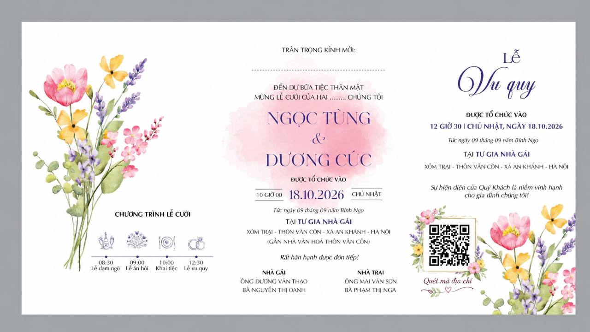

# Ảnh tham khảo do người dùng cung cấp

Lưu nguyên bản 1 ảnh thiệp giấy và 8 ảnh chụp website mẫu đã gửi trong cuộc trò chuyện. Chỉ đổi tên file để dễ tra cứu; không chỉnh sửa nội dung ảnh.

| File | File gốc | Nội dung |
| --- | --- | --- |
| [01-thiep-giay.jpg](01-thiep-giay.jpg) | 1000031374.jpg | Thiệp giấy Ngọc Tùng & Dương Cúc: nguồn tên, bố mẹ, địa chỉ, ngày/giờ, màu sắc và hoa |
| [02-mo-thiep.jpg](02-mo-thiep.jpg) | 1000031376.jpg | Màn mở thiệp mẫu |
| [03-anh-mo-dau.jpg](03-anh-mo-dau.jpg) | 1000031377.jpg | Ảnh mở đầu và tên đôi uyên ương trong demo |
| [04-thong-tin-gia-dinh.jpg](04-thong-tin-gia-dinh.jpg) | 1000031378.jpg | Bố cục thông tin hai gia đình |
| [05-album.jpg](05-album.jpg) | 1000031379.jpg | Album và phần thông tin lễ trong demo |
| [06-thong-tin-tiec.jpg](06-thong-tin-tiec.jpg) | 1000031380.jpg | Thông tin tiệc, lịch tháng, thêm lịch và RSVP |
| [07-dia-diem.jpg](07-dia-diem.jpg) | 1000031381.jpg | Địa điểm, bản đồ và chỉ đường |
| [08-lich-trinh.jpg](08-lich-trinh.jpg) | 1000031382.jpg | Lịch trình và form sổ lưu bút |
| [09-so-luu-but.jpg](09-so-luu-but.jpg) | 1000031383.jpg | Form và danh sách lời chúc |

Website mẫu: https://chungdoi.com/vi/mau-thiep/minimalism-do-dam/demo

Các screenshot demo chỉ dùng tham khảo bố cục/chức năng. Không dùng ảnh đôi uyên ương demo làm ảnh Ngọc Tùng & Dương Cúc, không sao chép tên/ngày/giờ/địa chỉ/lời chúc của demo vào dữ liệu thật. Dress code và nội dung khác xuất hiện trong screenshot không làm thay đổi phạm vi đã yêu cầu. Website vẫn không có ngân hàng, QR chuyển khoản, mừng cưới hoặc dress code.

Xem [tài liệu nghiệp vụ](../NGHIEP-VU.md) để đọc nội dung chính thức và quy tắc của website. Thư mục này là tài liệu trong repo, không nằm trong thư mục assets `public` dùng để deploy website.
